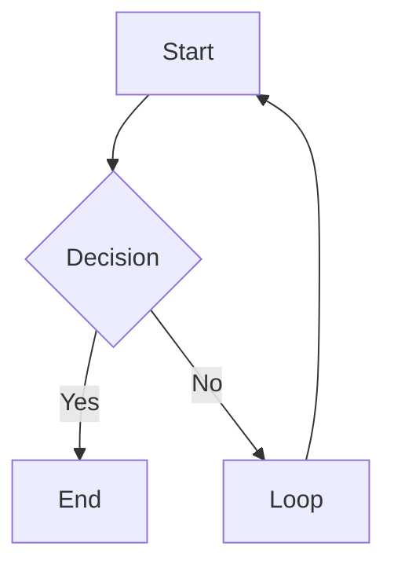

# obsidian-markdown: Obsidian Flavored Markdown

Reference this skill when writing any wiki page. Obsidian extends standard Markdown with wikilinks, embeds, callouts, and properties.

---

## Wikilinks

| Syntax | What it does |
|---|---|
| `[[Note Name]]` | Basic link |
| `[[Note Name\|Display Text]]` | Aliased link |
| `[[Note Name#Heading]]` | Link to a heading |
| `[[Note Name#^block-id]]` | Link to a block |

Rules:
- Case-sensitive on some systems
- No path needed: resolve by filename uniqueness
- If same name, use `[[Folder/Note Name]]` to disambiguate

---

## Embeds

| Syntax | What it does |
|---|---|
| `![[Note Name]]` | Embed a full note |
| `![[Note Name#Heading]]` | Embed a section |
| `![[image.png]]` | Embed an image |
| `![[image.png\|300]]` | Embed with width 300px |
| `![[document.pdf]]` | Embed a PDF |

---

## Callouts

```markdown
> [!note]
> Default informational callout.

> [!note] Custom Title
> Callout with custom title.

> [!note]- Collapsible (closed)
> Click to expand.

> [!note]+ Collapsible (open)
> Click to collapse.
```

### Common Types

| Type | Use for |
|------|---------|
| `note` | General notes |
| `info` | Information |
| `tip` | Tips and highlights |
| `warning` | Warnings |
| `danger` | Critical issues |
| `example` | Examples |
| `quote` | Quotations |
| `contradiction` | Conflicting info (wiki) |

---

## Properties (Frontmatter)

```yaml
---
type: concept
title: "Note Title"
created: 2026-04-08
updated: 2026-04-08
tags:
  - tag-one
  - tag-two
status: developing
related:
  - "[[Other Note]]"
sources:
  - "[[source-page]]"
---
```

Rules:
- Flat YAML only
- Dates as `YYYY-MM-DD`
- Lists as `- item`
- Wikilinks in YAML must be quoted

---

## Tags

```markdown
#tag-name             : inline tag
#parent/child-tag     : nested tag
```

In frontmatter:
```yaml
tags:
  - research
  - ai/obsidian
```

---

## Text Formatting

| Syntax | Result |
|---|---|
| `**bold**` | Bold |
| `*italic*` | Italic |
| `~~strikethrough~~` | Strikethrough |
| `==highlight==` | Highlighted text |

---

## Math

Inline: `$E = mc^2$`

Block:
```markdown
$$
\int_0^\infty e^{-x} dx = 1
$$
```

---

## Code Blocks

````markdown
```python
def hello():
    return "world"
```
````

---

## Mermaid Diagrams

````markdown

````

---

## What NOT to Do

- Do not use `[link text](path/to/note.md)` for internal links
- Do not use HTML inside callouts
- Do not use `##` inside callout body
- Do not write `tags: [a, b, c]` inline in frontmatter
- Do not write ISO datetimes in frontmatter
